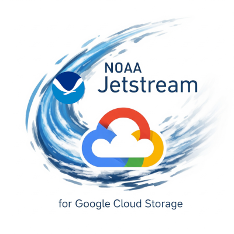
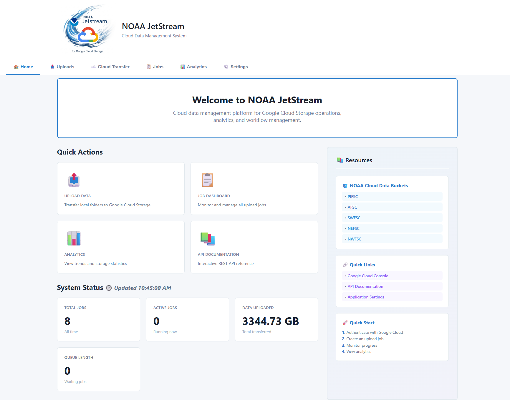
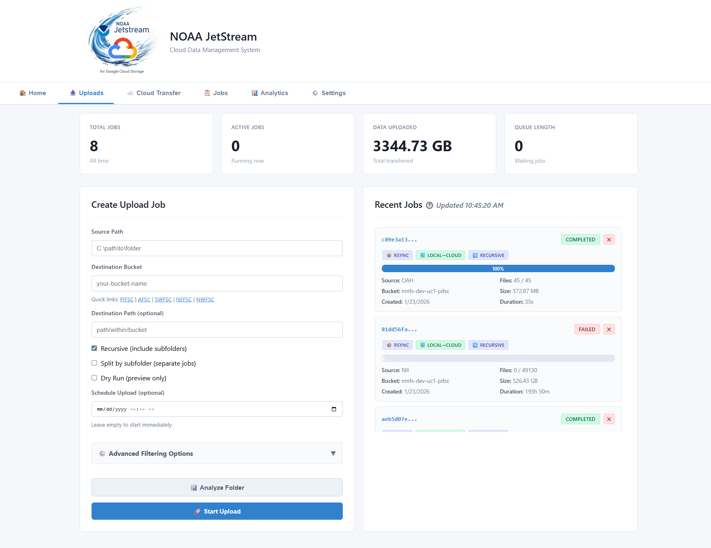
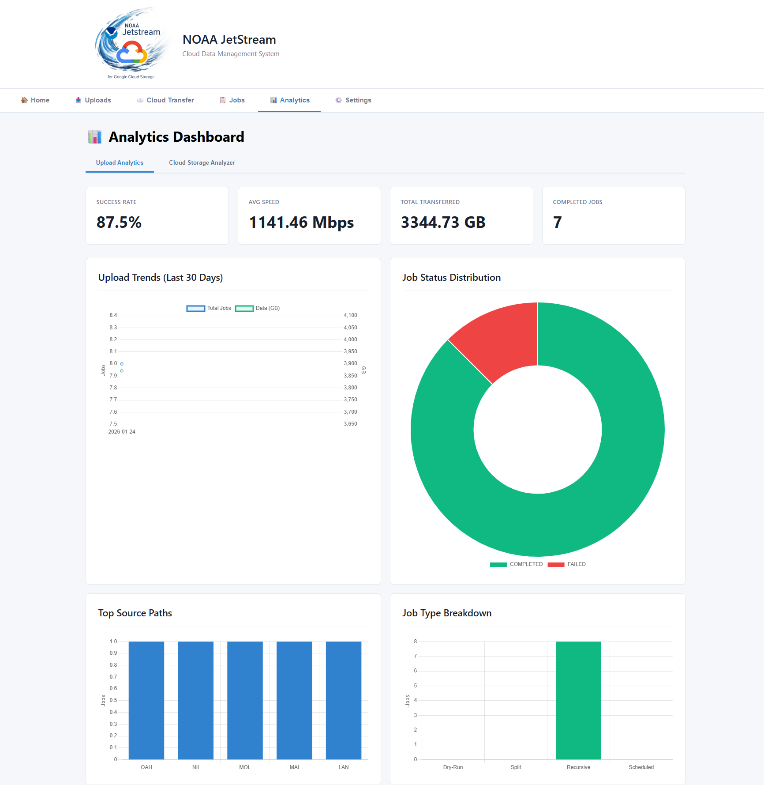

# NOAA JetStream — Cloud Data Management System


A comprehensive web-based application for managing Google Cloud Storage uploads with features including job queuing, real-time analytics, cloud bucket analysis, and batch processing capabilities.

### Features

- **Upload Management**
- **Analytics & Monitoring**
- **Cloud Bucket Analysis**
- **File Filtering**
- **Web Dashboard**

## Screenshots

| Dashboard | Upload Jobs | Analytics |
|-----------|-------------|----------|
|  |  |  |

### Prerequisites

- **Python 3.10+**
- **Google Cloud SDK** (includes gsutil)
- **Permissions** to target GCS buckets

### Installation

### 1) Install Google Cloud SDK
Download and install from: https://cloud.google.com/sdk/docs/install

### 2) Authenticate with Google Cloud
In a terminal, sign in to enable GCS access:

```bash
gcloud auth login --no-launch-browser
gcloud auth application-default login --no-launch-browser
```

Verify access (optional):
```bash
gsutil ls
gcloud auth list
```

### 3) Install Python Dependencies
From the project directory (and in terminal - python OK):

```bash
cd jetstream
pip install -r requirements.txt
```

## Starting the Application

### Python Command
```bash
python -m uvicorn jetstream_api.main:app --reload
#python -m uvicorn jetstream_api.main:app --reload --host 0.0.0.0 --port 8000
```

The application will start on `http://localhost:8000`

## Troubleshooting
**Cannot deploy the app:**
- Check error messages for file or package not found
- pip install relevant packages (refer to requirements.txt)
```bash
pip install uvicorn
pip install fastapi
pip install google-cloud-storage
```

**Cannot connect to GCS:**
- Verify authentication: `gcloud auth list`
- Check bucket permissions
- Ensure Application Default Credentials are set

**Jobs stuck in queue:**
- Check queue status in dashboard
- Verify no jobs are blocking the queue
- Restart the application if needed

**Database errors:**
- Delete `jetstream.db` to reset (loses history)
- Check file permissions in application directory

**API not responding:**
- Check if port 8000 is already in use
- View logs in terminal for error messages
- Ensure all dependencies are installed

----------
#### Disclaimer
This repository is a scientific product and is not official communication of the National Oceanic and Atmospheric Administration, or the United States Department of Commerce. All NOAA GitHub project content is provided on an 'as is' basis and the user assumes responsibility for its use. Any claims against the Department of Commerce or Department of Commerce bureaus stemming from the use of this GitHub project will be governed by all applicable Federal law. Any reference to specific commercial products, processes, or services by service mark, trademark, manufacturer, or otherwise, does not constitute or imply their endorsement, recommendation or favoring by the Department of Commerce. The Department of Commerce seal and logo, or the seal and logo of a DOC bureau, shall not be used in any manner to imply endorsement of any commercial product or activity by DOC or the United States Government.

## License
See the [LICENSE.md](./LICENSE.md) for details
