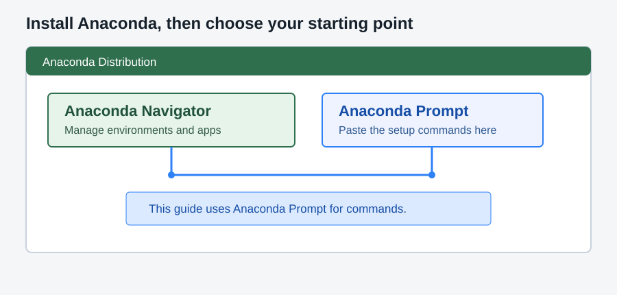
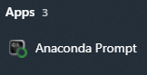
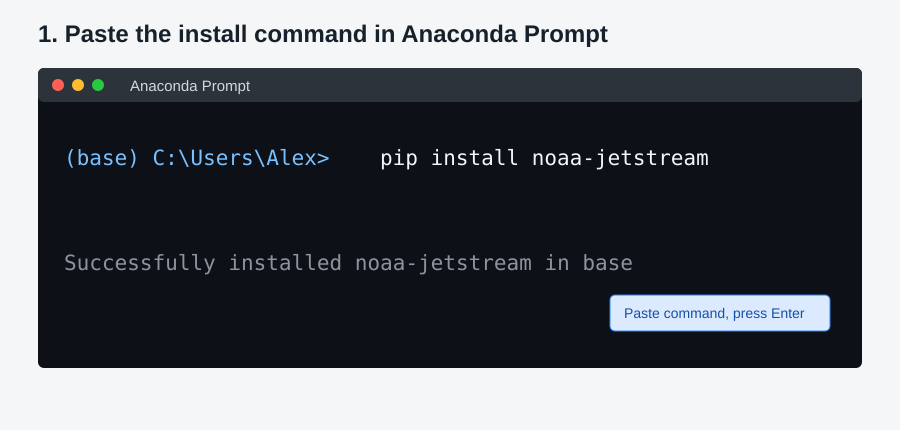
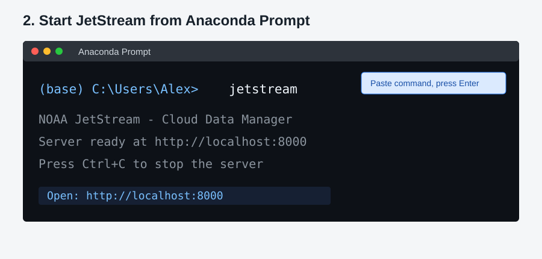

# NOAA JetStream — Cloud Data Management Transfer System


A comprehensive web-based application for managing Google Cloud Storage uploads and Google Drive transfers, with features including job queuing, real-time analytics, and batch processing capabilities.

### Features

- **Upload Management** — queue-backed GCS uploads with retry, scheduling, and no-clobber support
- **Analytics & Monitoring** — real-time job stats, file-type breakdown, activity timeline
- **Cloud Bucket Analysis** — browse and analyze GCS bucket contents
- **Native Google Drive Upload** — OAuth-authenticated upload and folder sync to Google Drive
- **File Filtering** — include/exclude patterns for uploads
- **Web Dashboard** — browser-based UI
- **Terminal UI (TUI)** — full-featured htop-style dashboard for terminals and remote sessions

## Screenshots

| Dashboard | Upload Jobs | Analytics |
|-----------|-------------|----------|
|  |  |  |


This guide is for first-time users. Advanced setup, development instructions, Google Drive OAuth, audit commands, environment variables, and detailed TUI controls are in the [**advanced user guide**](./advanced_readme.md).

## What you need (prerequisites)
For the basic web dashboard:
- Windows 10 or later, macOS, or Linux
- Python 3.9 or newer
   - Note: On Windows, [Anaconda Distribution](https://www.anaconda.com/download) is recommended, which includes Anaconda Navigator, Conda, and Anaconda Prompt
- [Google Cloud SDK](https://cloud.google.com/sdk/docs/install) — for cloud upload features
- **Permissions** to target cloud buckets

### Google Cloud Setup

Required for Google Cloud upload features.Install Google Cloud SDK
- Download from: https://cloud.google.com/sdk/docs/install
```bash
# Authenticate command
gcloud auth login
```
> **⚠️ Important:** If you encounter a `Reauthentication required.` error, Google requires rotating or re-authenticating credentials at unspecified times(~ every 16 hrs).
>
> To fix this, simply login again
## Install Anaconda on Windows

The easiest Windows setup for new users is [Anaconda Distribution](https://www.anaconda.com/download). It includes:

- **Anaconda Navigator**, a graphical application for managing environments and launching tools
- **Anaconda Prompt**, a terminal that already knows how to use `conda` and Python

During installation, the default options are usually appropriate. After installation, open **Anaconda Navigator** from the Start menu when you want a graphical overview, or open **Anaconda Prompt** when you want to paste commands.



## Quick start on Windows

### 1. Open Anaconda Prompt

In Windows Start menu Search, type anaconda and launch **Anaconda Prompt**. Paste the commands below into that window, one command at a time.



### 2. Install JetStream in the base environment

```powershell
pip install noaa-jetstream
```

The `pip install` command installs JetStream into Anaconda's active `base` environment. This is the simplest setup for getting started. A separate conda environment is optional and is covered in the [advanced guide](./advanced_readme.md).

`pip` is Python's package installer. It downloads and installs JetStream and its required Python components. After pasting the command, press **Enter** to run it and wait for the installation to finish.

### 3. Start the Jetstream Dashboard

```powershell
jetstream
```

After pasting the command, press **Enter** to start JetStream.

JetStream starts a local server and normally opens your browser automatically. If it does not, open [http://localhost:8000](http://localhost:8000) yourself.



Keep the Anaconda Prompt window open while you use the dashboard. Press `Ctrl+C` in that window to stop the server.

### 4. Authenticate with Google Cloud when needed

Before using GCS upload, bucket browsing, or cloud analysis features, install the Google Cloud SDK and authenticate:

```powershell
gcloud auth login
```

Your Google account must have permission to access the target bucket. If Google reports `Reauthentication required`, run the login command again.

## What to do next

Once the dashboard is open:

1. Use **Uploads** to select a local folder and create an upload job.
2. Use **Jobs** to monitor queued, running, completed, and failed work.
3. Use **Analytics** to review activity and file types.
4. Use **Cloud** or **Cloud Audit** after Google Cloud authentication is complete.

## Create Desktop Shortcuts
To create optional Windows desktop and Start Menu shortcuts:

```powershell
jetstream-create-shortcuts
```

## Updating JetStream

Run this command in the same environment where JetStream was installed:

```powershell
pip install --no-cache --upgrade noaa-jetstream
```

Check the available server options with:

```powershell
jetstream --help
```

## Troubleshooting

### `conda` or `jetstream` is not recognized

Open Anaconda Prompt instead of a regular Command Prompt. Then install JetStream into the active base environment:

```powershell
python -m pip install --upgrade noaa-jetstream
```

If `conda` is not available, install [Anaconda Distribution](https://www.anaconda.com/download) and reopen Anaconda Prompt.

### Port 8000 is already in use

Start JetStream on another port and open the matching URL:

```powershell
jetstream --port 8080
```

Open [http://localhost:8080](http://localhost:8080).

### The dashboard starts but cloud operations fail

Confirm that the Google Cloud SDK is available and that the correct account is active:

```powershell
gcloud auth list
gcloud projects list
```

Also verify that your account has permission to access the bucket and that the bucket name is correct.

### JetStream will not start

From a source checkout, run the diagnostic script in the project folder:

```powershell
python diagnose.py
```

The diagnostic script requires Python 3.10 or newer. For additional startup logging, run:

```powershell
jetstream --log-level debug
```
----

#### Disclaimer
This repository is a scientific product and is not official communication of the National Oceanic and Atmospheric Administration, or the United States Department of Commerce. All NOAA GitHub project content is provided on an 'as is' basis and the user assumes responsibility for its use. Any claims against the Department of Commerce or Department of Commerce bureaus stemming from the use of this GitHub project will be governed by all applicable Federal law. Any reference to specific commercial products, processes, or services by service mark, trademark, manufacturer, or otherwise, does not constitute or imply their endorsement, recommendation or favoring by the Department of Commerce. The Department of Commerce seal and logo, or the seal and logo of a DOC bureau, shall not be used in any manner to imply endorsement of any commercial product or activity by DOC or the United States Government.

## License
See the [LICENSE.md](./LICENSE.md) for details