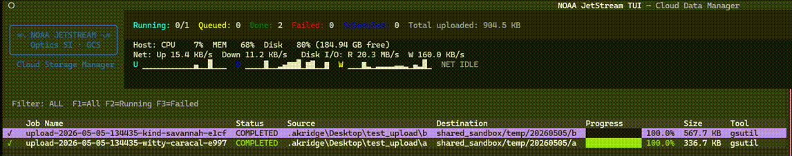

# NOAA JetStream — Cloud Data Management Transfer System


A comprehensive web-based application for managing Google Cloud Storage uploads with features including job queuing, real-time analytics, cloud bucket analysis, and batch processing capabilities.

### Features

- **Upload Management**
- **Analytics & Monitoring**
- **Cloud Bucket Analysis**
- **File Filtering**
- **Web Dashboard**
- **Terminal UI (TUI)** — full-featured htop-style dashboard for terminals and remote sessions

## Screenshots

| Dashboard | Upload Jobs | Analytics |
|-----------|-------------|----------|
|  |  |  |

## **Terminal UI (TUI)** Screenshot


### Prerequisites

- **Python 3.9+**
- **Google Cloud SDK** (includes gsutil) — for cloud upload features
- **Permissions** to target GCS buckets
---
### Google Cloud Setup

Required only for cloud upload features:
```bash
# Install Google Cloud SDK
# Download from: https://cloud.google.com/sdk/docs/install

# Authenticate
gcloud auth login --no-launch-browser
gcloud auth application-default login --no-launch-browser

# Verify access (optional)
gsutil ls
gcloud auth list
```

### Installation
#### Option 1: Install from PyPI (Recommended)
- Link: https://pypi.org/project/noaa-jetstream/
```bash
pip install noaa-jetstream
```

> **Using Anaconda/conda?** If you see dependency resolver warnings, use `uv` (recommended) or `--no-cache-dir`:
> ```bash
> # Option A: use uv (faster, cleaner resolver — recommended for conda users)
> pip install uv
> uv pip install noaa-jetstream
> # May need to create virtual environment first, so do it in a local directory then activate uv venv then .venv\Activate\scripts.bat
> 
> # Option B: skip pip cache
> pip install --no-cache-dir --no-user noaa-jetstream
> ```

#### Upgrade
```
uv pip install --no-cache --upgrade noaa-jetstream
```

#### Option 2: Install from Source (Development)

```bash
# Clone the repository
git clone https://github.com/MichaelAkridge-NOAA/jetstream.git
cd jetstream

# Install in development mode
pip install -e .

# Or using uv (recommended)
pip install uv
uv pip install -e ".[dev]"
# May need to pip install uvicorn, pip install fastapi, pip install google-cloud-storage separately
```

---

## Starting the Application

### If Installed via pip

```bash
# Start the server (opens browser automatically)
jetstream

# view options
jetstream --help
# With custom options
jetstream --port 9000
jetstream --host 127.0.0.1 --port 8080
jetstream --no-browser
jetstream --log-level debug
```

### If Running from Source

```bash
# Using the CLI
python main.py

# Or with the diagnostic startup script
python start.py

# Or directly with uvicorn
python -m uvicorn jetstream.main:app --reload
```

The application will start on **http://localhost:8000** and automatically open in your default browser.

---

## Terminal UI (TUI)

JetStream ships a full terminal dashboard — think **htop + ranger + gsutil** — that runs in any terminal or SSH session without a browser.
## Screenshots

| Dashboard | Upload Jobs | Analytics |
|-----------|-------------|----------|
|  |  |  |


### Launch

```bash
# If installed via pip
jetstream-tui

# From source
python -m jetstream.tui.cli
```

### Screens & Key Bindings

#### Dashboard (main screen)
The dashboard opens automatically and shows a live two-panel layout:
- **Left (60%)** — scrollable job table with status icons, progress bars, tool, size, and destination
- **Right (40%)** — selected job detail: metadata card + live log tail

| Key | Action |
|-----|--------|
| `R` | Refresh job list |
| `N` | New upload job (opens form) |
| `B` | Open GCS bucket browser |
| `P` | Pause / resume queue |
| `C` | Cancel selected job |
| `T` | Retry selected job |
| `X` | Clear all completed jobs |
| `D` | Delete selected job |
| `F1` | Show all jobs |
| `F2` | Show running jobs only |
| `F3` | Show failed jobs only |
| `Ctrl+C` | Quit |

The queue status bar at the top shows live counts (Running / Queued / Done / Failed / Scheduled), total bytes uploaded, and a **PAUSED** indicator when the queue is paused.

#### New Job Form (`N`)
A guided form for creating upload jobs:

- Source path (local folder)
- GCS destination (`gs://bucket/path`)
- Upload tool (`gcloud` / `gsutil` / `rclone`)
- Threads, dry-run, recursive, no-clobber, split-folder toggles
- Auto-retry settings and exclude patterns
- Optional scheduled start time

Press **Analyze** to scan the source folder before submitting.

#### Bucket Browser (`B`)
An interactive ranger-style GCS browser:

- Type a bucket name or full `gs://bucket/prefix/path` URI and press **Enter** or **Browse**
- Navigate into virtual folders with **Enter**, go up with **Backspace**
- Columns: type (📁/📄), name, size, last modified

| Key | Action |
|-----|--------|
| `Enter` | Drill into prefix / folder |
| `Backspace` | Go up one level |
| `R` | Refresh current listing |
| `Esc` | Back to dashboard |

#### Bucket Analytics (`Summary` button in browser)
A full-screen analytics view for the current bucket path:

| Section | Content |
|---------|---------|
| **Overview** | Total files, total size, average size, top file type, folder count |
| **Top Folders by Size** | Horizontal Unicode bar chart, size, count, % of total |
| **Top Folders by File Count** | Count-sorted bar chart |
| **File Type Distribution** | Extension breakdown (`.tif`, `.csv`, etc.) |
| **Size Distribution** | `<1 KB / 1 KB–1 MB / 1–100 MB / >100 MB` buckets |
| **Activity Timeline** | Files-modified-per-month bars + sparkline trend |
| **Newest / Oldest Files** | 8 most-recently and 8 least-recently modified files |

The analytics scan is scoped to whatever prefix you have navigated to in the browser (not the whole bucket unless you're at root). A scan cap of 5,000 objects applies; a warning is shown if hit.

Press `R` to re-scan, `Esc` to return to the browser.

### Requirements

The TUI requires `textual>=0.80.0` (installed automatically with `noaa-jetstream`). For development extras:

```bash
pip install "noaa-jetstream[dev]"
# or
uv pip install -e ".[dev]"
```

---

Desktop and Start Menu shortcuts are included with the default install. The shortcut will automatically use the JetStream icon (`icon.ico`) when created.

```bash
# Create desktop + Start Menu shortcut (uses JetStream icon automatically)
jetstream-create-shortcuts

# Remove shortcuts
jetstream-remove-shortcuts
```

Shortcuts launch JetStream directly using the current Python environment and open a terminal window. On Windows a `.lnk` shortcut is created on the desktop and in the Start Menu. On macOS/Linux a `.app`/`.desktop` shortcut is created in Applications.

### Troubleshooting Startup Issues

**If the server appears to start but you can't connect:**

1. **Run diagnostics:**
   ```bash
   python diagnose.py
   ```
   
2. **Run with debug logging:**
   ```bash
   jetstream --log-level debug
   # or from source:
   python -m uvicorn jetstream.main:app --reload --log-level debug
   ```
---

## Troubleshooting

**Cannot connect to GCS:**
- Verify authentication: `gcloud auth list`
- Check bucket permissions
- Ensure Application Default Credentials are set

**Jobs stuck in queue:**
- Check queue status in dashboard
- Verify no jobs are blocking the queue
- Restart the application if needed

**Database errors:**
- Delete `jetstream.db` to reset (loses history)
- Check file permissions in application directory

**API not responding:**
- Check if port 8000 is already in use
- View logs in terminal for error messages
- Ensure all dependencies are installed

----------
#### Disclaimer
This repository is a scientific product and is not official communication of the National Oceanic and Atmospheric Administration, or the United States Department of Commerce. All NOAA GitHub project content is provided on an 'as is' basis and the user assumes responsibility for its use. Any claims against the Department of Commerce or Department of Commerce bureaus stemming from the use of this GitHub project will be governed by all applicable Federal law. Any reference to specific commercial products, processes, or services by service mark, trademark, manufacturer, or otherwise, does not constitute or imply their endorsement, recommendation or favoring by the Department of Commerce. The Department of Commerce seal and logo, or the seal and logo of a DOC bureau, shall not be used in any manner to imply endorsement of any commercial product or activity by DOC or the United States Government.

## License
See the [LICENSE.md](./LICENSE.md) for details
